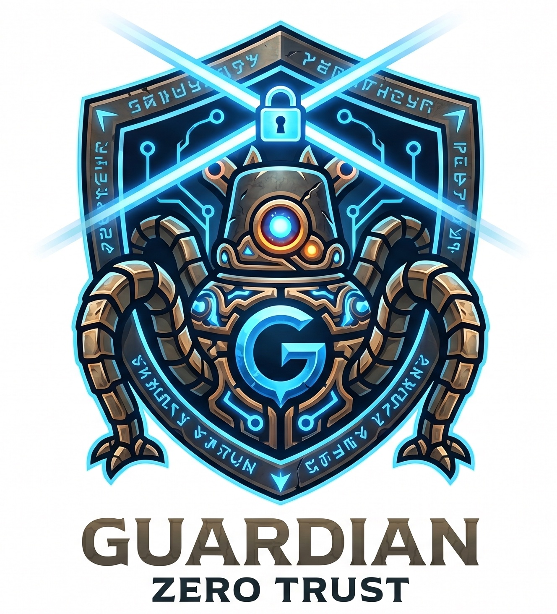

<div align="center">



## Enterprise Zero Trust Network & Secure Access Gateway

**Guardian** is an enterprise-grade zero-trust network and content security access control system based on the WireGuard protocol and application layer gateway.
</div>


---

# Overview

Guardian is a next-generation enterprise zero trust access platform that combines:

* WireGuard mesh networking
* Application-layer secure gateway
* Identity-aware access control
* Content security inspection
* Enterprise audit & governance
* Secure AI infrastructure access

Unlike traditional VPN solutions, Guardian does not only provide connectivity.

It provides:

* Secure infrastructure access
* Secure internal application publishing
* Fine-grained security policies
* Content-aware protection
* Full auditability
* Unified identity & security governance

---

# Why Guardian?

Traditional VPNs only solve network connectivity.

Modern enterprises additionally need:

* SSO + MFA
* Secure Git access
* Kubernetes access governance
* API security
* Content filtering
* Security auditing
* AI infrastructure protection
* Internal application publishing
* Zero trust access policies

---

# Architecture

## High-Level System Architecture

```text
                                    ┌─────────────────────┐
                                    │   Identity Provider │
                                    │  SSO / OAuth / MFA  │
                                    └─────────┬───────────┘
                                              │
                                              ▼

                           ┌─────────────────────────────────┐
                           │      Guardian Control Plane     │
                           │─────────────────────────────────│
                           │ • Identity & Access Control     │
                           │ • Policy Engine                 │
                           │ • Device Management             │
                           │ • Audit & Compliance            │
                           │ • Security Analytics            │
                           │ • Content Security Policies     │
                           └─────────────┬───────────────────┘
                                         │
                  ┌──────────────────────┴──────────────────────┐
                  │                                             │
                  ▼                                             ▼

      ┌────────────────────────────┐         ┌────────────────────────────┐
      │ WireGuard Mesh Network     │         │ Secure Application Gateway │
      │────────────────────────────│         │────────────────────────────│
      │ • P2P Connectivity         │         │ • Reverse Proxy            │
      │ • NAT Traversal            │         │ • SSO Authentication       │
      │ • Route Management         │         │ • MFA Enforcement          │
      │ • Encrypted Overlay        │         │ • Access Policies          │
      │ • Multi-network Support    │         │ • Secure Publishing        │
      └──────────────┬─────────────┘         └──────────────┬─────────────┘
                     │                                      │
                     ▼                                      ▼

         ┌──────────────────────┐             ┌──────────────────────────┐
         │ Infrastructure Layer │             │ Content Security Engine  │
         │──────────────────────│             │──────────────────────────│
         │ • SSH Servers        │             │ • DLP Inspection         │
         │ • Kubernetes         │             │ • API Security           │
         │ • Databases          │             │ • AI/LLM Protection      │
         │ • Cloud VPCs         │             │ • Sensitive Data Scan    │
         │ • Internal Services  │             │ • Audit Logging          │
         └──────────────────────┘             └──────────────────────────┘
```

---

# Core Capabilities

## Zero Trust Private Network

Guardian builds an encrypted private mesh network using WireGuard.

Features include:

* Peer-to-peer encrypted connectivity
* NAT traversal
* Multi-platform support
* Route management
* Private DNS
* Site-to-site networking
* Multi-network segmentation
* Kubernetes integration

---

## Secure Application Gateway

Guardian securely exposes internal applications through:

* Identity-aware reverse proxy
* SSO integration
* MFA enforcement
* Access policy evaluation
* Secure browser access
* Public/private application publishing

Supported applications:

* GitLab
* Jenkins
* Grafana
* Kibana
* Kubernetes Dashboard
* Internal APIs
* Admin systems

---

## Content Security Access Control

Guardian adds content-aware security capabilities beyond traditional VPN solutions.

### Examples

### Git Security

Prevent:

* Secret leakage
* Credential commits
* Sensitive repository cloning
* Unauthorized Git operations

### API Security

Inspect and control:

* Sensitive API requests
* Dangerous payloads
* Internal token leakage
* Data exfiltration attempts

### AI & LLM Security

Protect:

* Internal prompts
* Enterprise knowledge
* MCP servers
* AI agents
* Vector databases

### HTTP Content Filtering

Support:

* URL filtering
* Header inspection
* Request body inspection
* Response filtering
* DLP policies
* Sensitive keyword detection

---

# Enterprise Audit & Compliance

Guardian provides enterprise-grade security auditing capabilities.

## Audit Logs

Track:

* User login activity
* Device access
* SSH sessions
* Application access
* Policy decisions
* Security events
* Content filtering actions

## Compliance

Designed for:

* SOC2
* ISO27001
* Internal governance
* Security operation teams

## Session Traceability

Every operation becomes:

* Traceable
* Searchable
* Auditable
* Exportable

---

# Guardian vs Traditional VPN

| Capability                | Traditional VPN | Guardian |
| ------------------------- | --------------- | -------- |
| WireGuard Networking      | Partial         | ✅        |
| Zero Trust Access         | ❌               | ✅        |
| SSO + MFA                 | Limited         | ✅        |
| Application Gateway       | ❌               | ✅        |
| Content Security Policies | ❌               | ✅        |
| Security Auditing         | Weak            | ✅        |
| AI/LLM Access Security    | ❌               | ✅        |
| Enterprise Governance     | Weak            | ✅        |
| Kubernetes Access Control | Limited         | ✅        |

---

# Typical Use Cases

## Secure Developer Access

Securely access:

* GitLab
* Kubernetes
* SSH servers
* Databases
* Internal APIs

without exposing infrastructure to the public internet.

---

## Secure AI Infrastructure

Protect:

* LLM gateways
* MCP servers
* AI agents
* Vector databases
* Internal knowledge systems

through identity-aware security policies.

---

## Multi-Cloud Enterprise Networking

Securely connect:

* AWS
* Azure
* GCP
* Kubernetes clusters
* On-premise datacenters
* Remote developers

through a unified encrypted mesh network.

---

# Build Guardian From Source

Guardian clients require elevated privileges to configure networking and WireGuard interfaces.

## Environment Requirements

* [Go](https://go.dev/dl/?utm_source=chatgpt.com) version **1.25.5+**
* Available Guardian Management / Signal endpoints
* Setup Key or existing network access

---

# Build Client

```bash
cd guardian
go mod tidy

CGO_ENABLED=0 go build -o guardian ./client
```

---

# Run Guardian Client

Guardian requires root / Administrator privileges.

## Mode A — Daemon + CLI

Install and start the Guardian service:

```bash
sudo ./guardian service install
sudo ./guardian service start

sudo ./guardian up --log-level debug --log-file console
```

---

## Mode B — Foreground Mode

Run without daemon:

```bash
sudo ./guardian up --foreground-mode --log-level debug --log-file console
```

Shortcut:

```bash
sudo ./guardian up -F
```

This mode is recommended for:

* Development
* Debugging
* Local testing

---

# Build Guardian UI

Build the UI client:

```bash
go build -o guardian-ui ./client/ui
```

Run UI:

```bash
sudo ./guardian-ui
```

The UI still relies on Guardian backend networking capabilities.

---

# Run UI With Daemon

```bash
sudo ./guardian service install
sudo ./guardian service start

sudo ./guardian-ui
```

---

# Troubleshooting

## Cannot connect to daemon

Check whether:

* foreground mode is enabled
* `guardian service` is running

## Permission denied

Run with:

```bash
sudo
```

or Administrator privileges on Windows.

## Cannot join network

Check:

* Management / Signal endpoint connectivity
* System time synchronization
* Proxy settings


